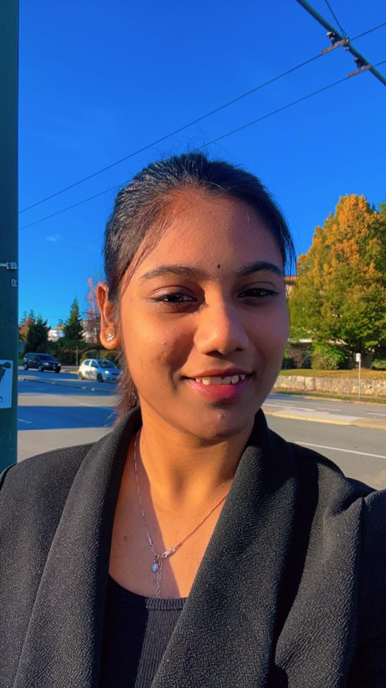

# 👋 Hi, I'm Rohini Gadagottu

Welcome to my MBA portfolio website! I’m a passionate and customer-focused professional currently pursuing my Master of Business Administration at **University Canada West** in Vancouver. With a background in **business administration** and hands-on experience in **retail sales and customer service**, I bring a blend of interpersonal excellence, product knowledge, and team collaboration to every role I take on.

---

## 🎯 Objective

I'm eager to grow in a fast-paced, dynamic environment that values innovation, sustainability, and employee development. My goal is to contribute meaningfully to customer-centric roles that align with business goals while continuously learning and evolving professionally.

---

## 🧩 Core Strengths

- Customer-first mindset using the **GUEST** approach (Greet, Uncover, Engage, Suggest, Thank)
- Upselling, product guidance, and warranty/service promotion
- Efficient POS operations and cash handling
- Visual merchandising and inventory support
- Collaborative team player with flexible availability
- Strong interpersonal and problem-solving skills

---

## 🧠 Personal Attributes

- **Enthusiastic & Energetic**: Always ready to go the extra mile to ensure excellent customer service.
- **Physically Fit & Reliable**: Comfortable with standing long hours, lifting, and working flexible schedules.
- **Passionate About Fitness**: A sports lover and fitness enthusiast who believes in leading with inspiration.
- **Detail-Oriented**: Focused on maintaining store standards and enhancing customer experiences.

---

## 🎓 Education

**MBA, Master of Business Administration**  
*University Canada West, Vancouver*  
*July 2024 – June 2026 (Expected)*

**BBA, Bachelor of Business Administration**  
*Telangana University, India*  
*August 2019 – June 2022*

---

📬 Feel free to explore the other sections of my website to learn more about my **resume**, **projects**, and **skills**. You can also connect with me via the [Contact](/contact.qmd) page.
